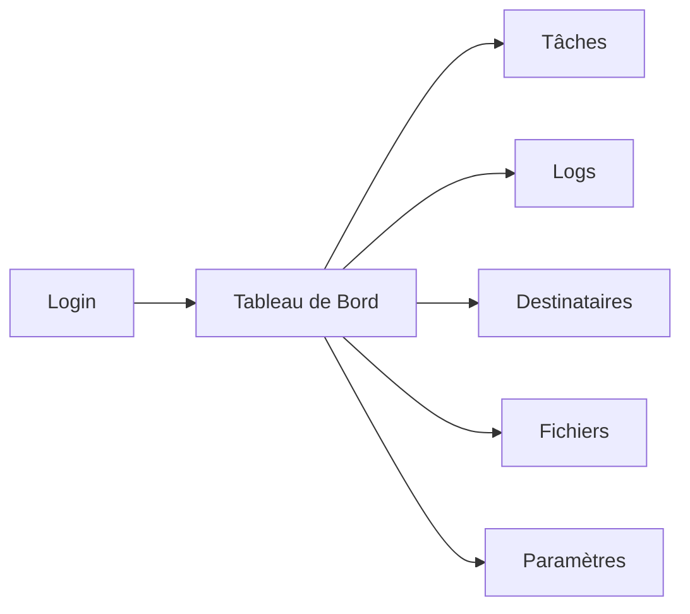

# Vue d'Ensemble - Guide Utilisateur

Bienvenue dans le guide utilisateur du Système d'Automatisation ! 🚀

---

## 🎯 Qu'est-ce que le Système d'Automatisation ?

Le **Système d'Automatisation** est une plateforme qui vous permet d'**automatiser des tâches répétitives** dans votre entreprise. 

### Principales Fonctionnalités

=== "Tâches Automatisées"
    - ✅ Exécution selon un horaire personnalisé
    - ✅ Planification simplifiée (pas besoin de CRON)
    - ✅ Monitoring en temps réel
    - ✅ Gestion d'erreurs automatique

=== "Notifications"
    - 📧 Emails avec pièces jointes
    - 📱 Messages WhatsApp instantanés
    - 💬 Intégration Amazon Chime
    - 🔔 Alertes en cas d'échec

=== "Fichiers"
    - 📊 Traitement Excel automatique
    - 📁 Upload et historique
    - 🔄 Processing automatisé
    - 📥 Téléchargement des résultats

=== "Intégrations"
    - 🔌 API CORTEX
    - 🌐 Services externes
    - 🔐 Authentification sécurisée
    - 📡 Communication temps réel

---

## 🗺️ Navigation dans l'Application

### Interface Principale

### Menu de Navigation

| Section | Description | Icône |
|---------|-------------|-------|
| **Tableau de Bord** | Vue d'ensemble et statistiques | 📊 |
| **Tâches** | Gestion des automatisations | ⚙️ |
| **Logs** | Historique des exécutions | 📝 |
| **Destinataires** | Contacts pour notifications | 👥 |
| **Fichiers** | Upload et traitement | 📁 |
| **Paramètres** | Configuration | ⚙️ |

---

## 👥 Qui Peut Utiliser l'Application ?

### Profils Utilisateurs

=== "Administrateur"
    **Accès complet** :
    
    - ✅ Créer/modifier/supprimer des tâches
    - ✅ Gérer les utilisateurs
    - ✅ Configurer le système
    - ✅ Accès à tous les logs
    - ✅ Gérer les destinataires

=== "Gestionnaire"
    **Gestion opérationnelle** :
    
    - ✅ Créer/modifier des tâches
    - ✅ Consulter les logs
    - ✅ Gérer les destinataires
    - ❌ Pas de gestion utilisateurs
    - ❌ Configuration limitée

=== "Utilisateur"
    **Consultation** :
    
    - ✅ Consulter le tableau de bord
    - ✅ Voir les logs
    - ❌ Pas de création de tâches
    - ❌ Pas de modification
    - ❌ Pas d'accès configuration

---

## 🚀 Premiers Pas

### 1. Connexion

1. Ouvrez http://localhost:4300
2. Entrez vos identifiants
3. Cliquez sur "Se connecter"

!!! tip "Premier login"
    Utilisez `admin@example.com` / `admin123` pour votre première connexion

### 2. Découvrir le Tableau de Bord

Le tableau de bord vous montre :

- 📊 **Statistiques** : Nombre de tâches, exécutions, taux de succès
- 📈 **Graphiques** : Performance sur 7 jours
- 📝 **Activité récente** : 10 dernières exécutions

### 3. Créer Votre Première Tâche

1. Cliquez sur **"Tâches"** dans le menu
2. Cliquez sur **"+ Nouvelle Tâche"**
3. Remplissez les informations :
   - **Nom** : Nom descriptif
   - **Description** : Ce que fait la tâche
   - **Type** : Type de traitement
   - **Planification** : Quand l'exécuter
4. **Activez** et **Créez** !

---

## 📚 Guide Complet

### Par Fonctionnalité

- [**Tableau de Bord**](dashboard.md) : Comprendre les statistiques
- [**Gestion des Tâches**](tasks.md) : Créer et gérer les automatisations
- [**Planification**](scheduling.md) : Configurer les horaires
- [**Destinataires**](recipients.md) : Gérer les notifications
- [**Historique**](logs.md) : Consulter les logs

### Par Cas d'Usage

- **Vérification quotidienne** : Routes, stocks, commandes
- **Rapports hebdomadaires** : Génération automatique
- **Alertes temps réel** : Notifications instantanées
- **Traitement de fichiers** : Excel, CSV, PDF

---

## 🎯 Cas d'Usage Typiques

### Exemple 1 : Vérification Quotidienne

!!! example "Vérifier la disponibilité des routes chaque matin"
    
    **Configuration** :
    
    1. Type : `Routenverfuegbarkeit`
    2. Planification : Quotidien à 08:00
    3. Notification : Email logistique@entreprise.com
    
    **Résultat** : Rapport Excel envoyé automatiquement chaque matin

### Exemple 2 : Rapport Hebdomadaire

!!! example "Générer un rapport chaque lundi"
    
    **Configuration** :
    
    1. Type : `StagingPlan`
    2. Planification : Hebdomadaire, Lundi 09:00
    3. Notification : Email + Chime
    
    **Résultat** : Rapport complet disponible en début de semaine

### Exemple 3 : Alerte Temps Réel

!!! example "Surveiller les anomalies"
    
    **Configuration** :
    
    1. Type : `DNRUnits`
    2. Planification : Toutes les 15 minutes
    3. Notification : WhatsApp en cas d'erreur
    
    **Résultat** : Réactivité immédiate sur les problèmes

---

## 🆘 Besoin d'Aide ?

### Ressources Disponibles

- 📖 [**FAQ**](../support/faq.md) : Questions fréquentes
- 🔧 [**Résolution de Problèmes**](../support/troubleshooting.md) : Solutions aux erreurs courantes
- 💬 [**Contact**](../support/contact.md) : Support technique

### Astuces Rapides

!!! tip "Gain de temps"
    - Utilisez le **copier/coller** pour dupliquer des tâches similaires
    - **Désactivez** temporairement au lieu de supprimer
    - Consultez les **logs** régulièrement pour anticiper les problèmes

!!! warning "Bonnes pratiques"
    - **Testez** d'abord avec une exécution manuelle
    - **Nommez** clairement vos tâches
    - **Documentez** la configuration dans la description
    - **Surveillez** les premiers jours après création

---

## 🎉 Prochaines Étapes

Maintenant que vous connaissez les bases :

1. 📊 [**Explorez le Tableau de Bord**](dashboard.md)
2. ⚙️ [**Créez votre Première Tâche**](tasks.md)
3. 📅 [**Maîtrisez la Planification**](scheduling.md)
4. 👥 [**Configurez les Notifications**](recipients.md)

---

**Bonne automatisation ! 🚀**

